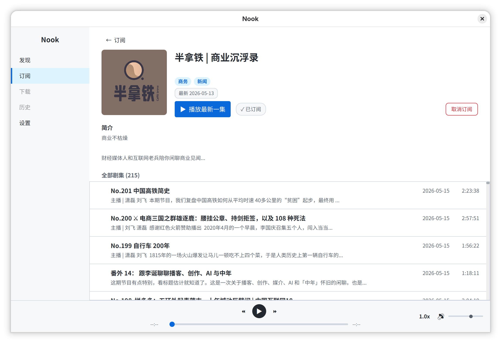

# Nook

<p align="center">
  <strong>🎧 跨平台播客客户端，基于 JavaFX 构建</strong>
</p>

<p align="center">
  
</p>

## 功能

- **RSS 订阅管理** — 输入播客 RSS 地址即可订阅，自动解析单集列表，支持列表和网格两种视图
- **发现页** — 基于 iTunes Search API，支持关键词搜索、分类浏览和热门播客推荐
- **播客详情** — 展示播客封面、描述、单集列表；支持订阅并查看最近更新
- **音频播放** — 内置 VLC 引擎，支持播放/暂停、倍速（0.5x–2.0x）、音量调节、进度拖拽
- **主题系统** — 内置 6 套主题（Primer、Cupertino、Nord 各含浅色/深色 + Dracula），支持跟随系统浅色/深色模式自动切换
- **设置页面** — 可视化切换浅色/深色主题，独立配置每种模式下的主题方案
- **输入法适配** — 自动检测 fcitx/ibus 输入法框架，Linux 下中文输入无缝支持

<p align="center">
  
</p>

## 技术栈

| 组件 | 方案 |
|------|------|
| UI 框架 | JavaFX 26 + AtlantaFX 2.1 |
| 音频引擎 | VLCJ 4.8（libvlc 原生库随发行版打包） |
| RSS 解析 | Rome 2.1 |
| JSON 序列化 | Gson 2.11 |
| 构建工具 | Maven |

## 快速开始

### 下载安装

前往 [Releases](https://github.com/chalmery/nook/releases) 页面下载对应平台安装包。

### 从源码构建

**环境要求**

- JDK 23+
- Maven 3.9+

```bash
git clone https://github.com/chalmery/nook.git
cd nook
mvn javafx:run
```

## 项目结构

```
src/main/java/top/yangcc/
├── NookApp.java                  # 应用入口
├── model/
│   ├── Podcast.java              # 播客数据模型
│   └── Episode.java              # 单集数据模型
├── rss/
│   └── RssParser.java            # RSS 订阅源解析
├── player/
│   └── AudioPlayer.java          # VLC 音频播放器封装
├── service/
│   ├── SubscriptionManager.java  # 订阅管理与本地持久化
│   └── ITunesSearchService.java  # iTunes 搜索 API 封装
├── ui/
│   ├── MainLayout.java           # 主布局（订阅/发现/设置路由）
│   ├── SidebarView.java          # 左侧导航栏
│   ├── SubscriptionGridView.java # 订阅网格视图
│   ├── EpisodeListView.java      # 单集列表
│   ├── PodcastDetailView.java    # 订阅播客详情页
│   ├── DiscoverView.java         # 发现页（搜索 + 分类 + 热门）
│   ├── DiscoverDetailView.java   # 发现详情页
│   ├── GenreChipBar.java         # 分类标签栏
│   ├── PlayerBar.java            # 底部播放控制栏
│   ├── SettingsView.java         # 设置页
│   ├── AddSubscriptionDialog.java # 添加订阅对话框
│   └── ThemeManager.java         # 主题管理与持久化
└── util/
    └── HtmlUtils.java            # HTML 文本清洗工具
```

## 主题

Nook 内置 6 套 AtlantaFX 主题，可在设置页面自由切换：

| 主题 | 类型 | 预览 |
|------|------|------|
| Primer Light | 浅色 | GitHub 风格 |
| Primer Dark | 深色 | GitHub 暗色风格 |
| Cupertino Light | 浅色 | macOS 风格 |
| Cupertino Dark | 深色 | macOS 暗色风格 |
| Nord Light | 浅色 | Nord 风格 |
| Nord Dark | 深色 | Nord 暗色风格 |
| Dracula | 深色 | 经典 Dracula 配色 |

开启"跟随系统"后，Nook 会根据操作系统浅色/深色模式自动切换对应主题。

## 跨平台

| 平台 | 支持 |
|------|------|
| Linux | Fedora / Ubuntu / Debian |
| macOS | Apple Silicon / Intel |
| Windows | 10 / 11 |

各平台 VLC 原生库已随发行版打包，无需单独安装 VLC。

## License

MIT License
